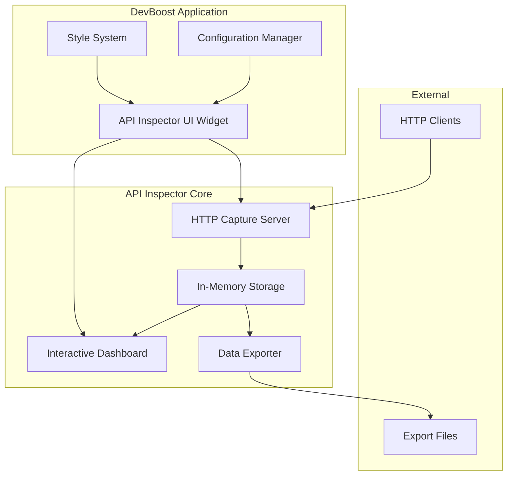

# Design Document

## Overview

The API Inspector is a comprehensive HTTP request monitoring tool that integrates seamlessly with the DevBoost application. It provides developers with real-time visibility into HTTP traffic through a catch-all server that captures requests, an interactive dashboard for analysis, persistent logging capabilities, and flexible export functionality.

The tool follows the established DevBoost architecture patterns, utilizing PyQt6 for the user interface, threading for non-blocking operations, and the existing configuration management system. The design emphasizes performance, usability, and integration consistency with other DevBoost tools.

## Architecture

### High-Level Architecture



### Component Interaction Flow

1. **Request Capture**: HTTP clients send requests to the capture server
2. **Data Processing**: Server processes and stores request data in memory
3. **Real-time Updates**: Dashboard receives updates via Qt signals
4. **Standard Logging**: Important events logged using application's standard logging system
5. **Export Generation**: Exporter creates formatted output files on demand

## Components and Interfaces

### 1. HTTP Capture Server (`APIInspectorServer`)

**Purpose**: Lightweight HTTP server that captures all incoming requests regardless of method or path.

**Key Features**:

- Multi-threaded request handling using `HTTPServer` and `ThreadingMixIn`
- Catch-all request handler that captures method, headers, query parameters, and body
- Configurable port with automatic fallback to available ports
- Graceful shutdown and cleanup mechanisms

**Interface**:

```python
class APIInspectorServer:
    def __init__(self, port: int = 9010, request_callback: callable = None)
    def start_server(self) -> bool
    def stop_server(self) -> None
    def get_server_info(self) -> dict
    def is_running(self) -> bool
```

**Threading Model**: Runs in separate QThread to prevent UI blocking

### 2. Request Storage (`RequestStorage`)

**Purpose**: Thread-safe in-memory storage for captured HTTP requests with efficient querying capabilities.

**Key Features**:

- Thread-safe operations using `threading.RLock`
- Circular buffer implementation to manage memory usage
- Fast filtering and searching capabilities
- Real-time statistics calculation

**Interface**:

```python
class RequestStorage:
    def __init__(self, max_requests: int = 10000)
    def add_request(self, request_data: dict) -> None
    def get_requests(self, filters: dict = None) -> list
    def get_statistics(self) -> dict
    def clear_requests(self) -> None
    def get_request_count(self) -> int
```

### 3. Interactive Dashboard (`APIInspectorDashboard`)

**Purpose**: PyQt6-based user interface providing real-time request monitoring and detailed inspection capabilities.

**Key Components**:

- **Request List**: Scrollable table showing captured requests with key information
- **Request Details**: Tabbed interface showing headers, query parameters, and body
- **Statistics Panel**: Real-time counters and charts
- **Filter Controls**: Search and filter functionality
- **Server Controls**: Start/stop server and configuration

**Layout Structure**:

```
┌─────────────────────────────────────────────────────────────┐
│ Server Controls [Start/Stop] [Port: 9010] [Status: Running] │
├─────────────────────────────────────────────────────────────┤
│ Statistics: [Total: 150] [GET: 80] [POST: 45] [Others: 25] │
├─────────────────────────────────────────────────────────────┤
│ Filters: [Search: ___] [Method: All▼] [Time: Last Hour▼]   │
├─────────────────────────────────────────────────────────────┤
│ Request List                    │ Request Details           │
│ ┌─────────────────────────────┐ │ ┌───────────────────────┐ │
│ │ Time    Method  URL         │ │ │ Headers │ Query │ Body │ │
│ │ 14:30   GET     /api/users  │ │ │                       │ │
│ │ 14:29   POST    /api/login  │ │ │ Content-Type:         │ │
│ │ 14:28   PUT     /api/user/1 │ │ │ application/json      │ │
│ │ ...                         │ │ │                       │ │
│ └─────────────────────────────┘ │ │ {                     │ │
│                                 │ │   "username": "test"  │ │
│                                 │ │ }                     │ │
│                                 │ └───────────────────────┘ │
└─────────────────────────────────────────────────────────────┘
```

### 4. Data Exporter (`DataExporter`)

**Purpose**: Flexible export system supporting multiple output formats with filtering capabilities.

**Supported Formats**:

- **JSON**: Complete request data with full structure preservation
- **CSV**: Tabular format suitable for spreadsheet analysis

**Export Features**:

- Date range filtering
- Method-based filtering
- URL pattern matching
- Memory-efficient streaming for large datasets

## Data Models

### Request Data Structure

```python
@dataclass
class HTTPRequestData:
    timestamp: datetime
    method: str
    url: str
    headers: dict[str, str]
    query_params: dict[str, list[str]]
    body: str
    client_ip: str
    request_id: str
    content_length: int
    user_agent: str
```

### Statistics Data Structure

```python
@dataclass
class RequestStatistics:
    total_requests: int
    method_breakdown: dict[str, int]
    requests_per_hour: list[int]
    average_body_size: float
    top_endpoints: list[tuple[str, int]]
    last_updated: datetime
```

## Error Handling

### Server Error Handling

- **Port Binding Failures**: Automatic port fallback mechanism
- **Request Processing Errors**: Graceful error logging without server shutdown
- **Memory Overflow**: Circular buffer prevents unlimited memory growth

### UI Error Handling

- **Server Start Failures**: User-friendly error messages with suggested solutions
- **Export Failures**: Progress indication and error reporting
- **Network Issues**: Connection status indicators and retry mechanisms

### Standard Logging

- **Application Events**: Use existing logging system for server start/stop, errors
- **Debug Information**: Optional verbose logging for troubleshooting
- **Error Reporting**: Standard error logging with appropriate log levels

## Testing Strategy

### Unit Testing

- **Server Components**: Mock HTTP requests and test request processing
- **Storage Components**: Test thread safety and data integrity
- **Export Components**: Validate output formats and filtering
- **UI Components**: Test user interactions and state management

## Security Considerations

### Request Data Handling

- **Sensitive Data**: Option to mask or exclude sensitive headers (Authorization, etc.)
- **Body Content**: Configurable limits on body size capture
- **Log File Security**: Appropriate file permissions for log files

### Server Security

- **Local Binding**: Server binds only to localhost by default
- **Request Validation**: Basic validation to prevent malformed request crashes
- **Resource Limits**: Configurable limits on request size and frequency

## Performance Optimizations

### Memory Management

- **Circular Buffer**: Prevents unlimited memory growth
- **Lazy Loading**: Request details loaded on-demand
- **Data Compression**: Optional compression for stored request bodies

### UI Performance

- **Virtual Scrolling**: Efficient handling of large request lists
- **Background Processing**: Non-blocking operations using QThread
- **Incremental Updates**: Batch UI updates to prevent excessive redraws

### I/O Performance

- **Export Streaming**: Memory-efficient streaming for large dataset exports
- **Background Processing**: Non-blocking export operations using QThread

## Configuration Options

### Server Configuration

```python
{
    "api_inspector": {
        "default_port": 9010,
        "max_requests_memory": 10000,
        "capture_body_max_size": 1048576,  # 1MB
        "mask_sensitive_headers": True
    }
}
```

### UI Configuration

```python
{
    "api_inspector_ui": {
        "auto_scroll": True,
        "refresh_interval_ms": 1000,
        "default_filters": {
            "time_range": "last_hour",
            "methods": ["GET", "POST", "PUT", "DELETE"]
        }
    }
}
```

## Integration with DevBoost

### Tool Registration

- Add API Inspector to the tools list in `main.py`
- Follow existing naming convention: `("🔍", "API Inspector", "api http request capture monitor debug")`
- Implement `create_api_inspector_widget()` function following established patterns

### Style Integration

- Utilize existing `get_tool_style()` for consistent appearance
- Follow established color schemes and typography
- Maintain responsive design principles

### Configuration Integration

- Extend existing `ConfigManager` with API Inspector settings
- Use established configuration patterns for persistence
- Provide sensible defaults aligned with other tools

### Scratch Pad Integration

- Support sending request data to scratch pad
- Format exported data for easy copying
- Enable quick sharing of request details
