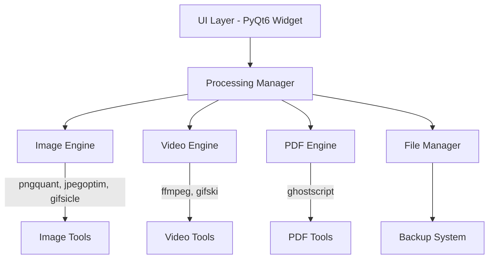

# Design Document

## Overview

The Desktop File Optimization Tool will be integrated into the existing DevBoost application as a new tool widget. The design leverages the current PyQt6-based architecture and follows the established patterns for tool creation. The tool will provide comprehensive file optimization capabilities for images, videos, and PDFs with an intuitive drag-and-drop interface, real-time feedback, and seamless desktop integration.

The tool architecture consists of three main layers:

1. **UI Layer**: PyQt6-based interface following DevBoost design patterns
2. **Processing Layer**: Optimization engines for different file types using open-source tools
3. **File Management Layer**: Backup system and file I/O operations

## Architecture

### High-Level Architecture



### Component Integration

The tool will integrate into the existing DevBoost application structure:

- Added to the tools list in `main.py`
- Follows the `create_*_widget()` pattern established by other tools
- Uses the existing styling system and scratch pad integration
- Leverages the current file dialog and status management patterns

## Components and Interfaces

### 1. Main Widget (`FileOptimizationWidget`)

**Purpose**: Primary UI container following DevBoost patterns
**Key Features**:

- Drag-and-drop file upload area
- Tabbed interface for different file types
- Real-time progress indicators
- Results display with before/after comparisons

**Interface**:

```python
class FileOptimizationWidget(QWidget):
    def __init__(self, style_func, scratch_pad=None)
    def handle_file_drop(self, file_paths: List[str])
    def update_progress(self, progress: int, message: str)
    def display_results(self, results: OptimizationResults)
```

### 2. Processing Manager (`OptimizationManager`)

**Purpose**: Coordinates optimization operations across different file types
**Key Features**:

- File type detection and routing
- Batch processing capabilities
- Progress tracking and error handling
- Results aggregation

**Interface**:

```python
class OptimizationManager(QObject):
    progress_updated = pyqtSignal(int, str)
    optimization_completed = pyqtSignal(object)

    def optimize_files(self, file_paths: List[str], settings: OptimizationSettings)
    def get_supported_formats(self) -> Dict[str, List[str]]
    def cancel_optimization(self)
```

### 3. File Type Engines

#### Image Engine (`ImageOptimizationEngine`)

**Tools Used**: pngquant, jpegoptim, gifsicle, libvips
**Features**:

- Format-specific optimization (PNG, JPEG, GIF, HEIC, TIFF)
- Downscaling with aspect ratio preservation
- Quality presets and custom settings
- Format conversion (HEIC→JPEG, TIFF→PNG/JPEG)

#### Video Engine (`VideoOptimizationEngine`)

**Tools Used**: ffmpeg, gifski
**Features**:

- Video compression with quality control
- Format conversion (MOV→MP4)
- Resolution downscaling
- Video-to-GIF conversion

#### PDF Engine (`PDFOptimizationEngine`)

**Tools Used**: ghostscript
**Features**:

- PDF compression and optimization
- Image quality reduction within PDFs
- Font subsetting and optimization

### 4. File Manager (`FileManager`)

**Purpose**: Handles file I/O operations and backup management
**Key Features**:

- Automatic backup creation
- Output file naming and placement
- Metadata preservation options
- Storage management

**Interface**:

```python
class FileManager:
    def create_backup(self, file_path: str) -> str
    def generate_output_path(self, input_path: str, suffix: str = "_optimized") -> str
    def cleanup_temp_files(self)
    def get_backup_folder_path(self) -> str
```

### 5. Settings Manager (`OptimizationSettings`)

**Purpose**: Manages user preferences and optimization parameters
**Key Features**:

- Quality presets for different file types
- Format conversion preferences
- Backup retention policies
- Default optimization settings

## Data Models

### OptimizationResult

```python
@dataclass
class OptimizationResult:
    input_path: str
    output_path: str
    original_size: int
    optimized_size: int
    compression_ratio: float
    processing_time: float
    file_type: str
    success: bool
    error_message: Optional[str] = None
```

### OptimizationSettings

```python
@dataclass
class OptimizationSettings:
    quality_preset: str
    output_format: Optional[str]
    max_width: Optional[int]
    max_height: Optional[int]
    preserve_metadata: bool
    create_backup: bool
    progressive_jpeg: bool
    custom_quality: Optional[int]
```

### FileTypeConfig

```python
@dataclass
class FileTypeConfig:
    supported_extensions: List[str]
    default_quality: int
    available_formats: List[str]
    optimization_tools: List[str]
```

## Error Handling

### Error Categories

1. **File Access Errors**: Permission issues, file not found, locked files
2. **Processing Errors**: Tool execution failures, corrupted files, unsupported formats
3. **System Errors**: Insufficient disk space, missing dependencies, memory issues
4. **User Input Errors**: Invalid dimensions, unsupported settings combinations

### Error Handling Strategy

- **Graceful Degradation**: Continue processing other files if one fails
- **User Feedback**: Clear error messages with suggested solutions
- **Logging**: Comprehensive logging for debugging and support
- **Recovery**: Automatic cleanup of partial operations

### Error Recovery Mechanisms

```python
class ErrorHandler:
    def handle_processing_error(self, error: Exception, file_path: str) -> bool
    def suggest_solution(self, error_type: str) -> str
    def cleanup_failed_operation(self, temp_files: List[str])
```

## Testing Strategy

### Unit Testing

- **File Type Engines**: Test optimization algorithms with various file formats
- **Processing Manager**: Test batch processing, error handling, and progress tracking
- **File Manager**: Test backup creation, file naming, and cleanup operations
- **Settings Manager**: Test configuration persistence and validation

### Integration Testing

- **Tool Integration**: Test external tool execution (pngquant, ffmpeg, etc.)
- **UI Integration**: Test drag-and-drop, progress updates, and result display
- **File System Integration**: Test file operations across different platforms

### Performance Testing

- **Large File Handling**: Test with files of various sizes (MB to GB range)
- **Batch Processing**: Test with multiple files simultaneously
- **Memory Usage**: Monitor memory consumption during optimization
- **Processing Speed**: Benchmark optimization times for different file types

### User Acceptance Testing

- **Workflow Testing**: Test complete user workflows from upload to save
- **Error Scenarios**: Test user experience with various error conditions
- **Accessibility**: Test keyboard navigation and screen reader compatibility

## Implementation Phases

### Phase 1: Core Infrastructure

- Basic widget structure and UI layout
- File drop handling and type detection
- Integration with existing DevBoost architecture

### Phase 2: Image Optimization

- Image engine implementation with PIL/Pillow
- Integration of pngquant, jpegoptim, gifsicle
- Basic UI controls for image optimization

### Phase 3: Video and PDF Support

- Video engine with ffmpeg integration
- PDF engine with ghostscript integration
- Enhanced UI for different file types

### Phase 4: Advanced Features

- Batch processing capabilities
- Backup management system
- Settings persistence and presets

### Phase 5: Polish and Optimization

- Performance optimizations
- Enhanced error handling
- UI/UX improvements and accessibility

## Security Considerations

### File Handling Security

- **Input Validation**: Strict file type and size validation
- **Sandboxing**: Isolate external tool execution
- **Temporary Files**: Secure cleanup of temporary files
- **Path Traversal**: Prevent directory traversal attacks

### External Tool Security

- **Tool Validation**: Verify external tool integrity
- **Parameter Sanitization**: Sanitize all parameters passed to external tools
- **Resource Limits**: Implement timeouts and resource limits for tool execution

## Performance Considerations

### Optimization Strategies

- **Lazy Loading**: Load optimization engines only when needed
- **Parallel Processing**: Process multiple files concurrently where possible
- **Memory Management**: Stream large files to avoid memory issues
- **Caching**: Cache optimization settings and tool configurations

### Resource Management

- **CPU Usage**: Limit concurrent operations based on system capabilities
- **Memory Usage**: Monitor and limit memory consumption
- **Disk Space**: Check available space before operations
- **Tool Lifecycle**: Efficient management of external tool processes

## Platform Compatibility

### Supported Platforms

- **macOS**: Primary development platform with native tool integration
- **Windows**: Full compatibility with Windows-specific file handling
- **Linux**: Support for common Linux distributions

### Tool Dependencies

- **Cross-platform Tools**: Ensure all external tools work across platforms
- **Installation**: Provide clear installation instructions for dependencies
- **Fallbacks**: Implement fallback mechanisms for missing tools

## Accessibility Features

### Keyboard Navigation

- Full keyboard accessibility for all controls
- Logical tab order and focus management
- Keyboard shortcuts for common operations

### Screen Reader Support

- Proper ARIA labels and descriptions
- Status announcements for optimization progress
- Clear error message communication

### Visual Accessibility

- High contrast mode support
- Scalable UI elements
- Clear visual feedback for all operations
