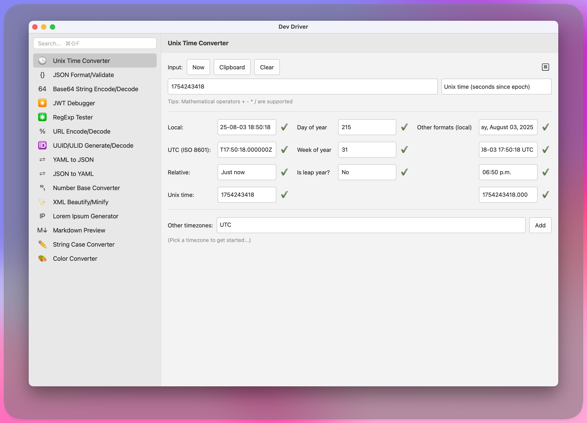

# Dev Boost

Tools to boost developer productivity and improve workflows



## Features

- **Unix Time Converter**: Convert between Unix timestamps, epoch times, and human-readable dates.
- **JSON Formatter/Validator**: Validate JSON, format with configurable indentation (2/4 spaces or tabs), minify, and
  query using JSONPath. Supports Unicode and complex nested structures.
- **Base64 String Encoder/Decoder**: Encode and decode text to/from Base64, with support for input/output via text
  fields and clipboard integration.
- **JWT Debugger**: Decode and verify JSON Web Tokens (JWTs), providing detailed inspection of token components.
- **RegExp Tester**: Test and match regular expressions against input strings, with pattern validation and result
  highlighting.
- **URL Encoder/Decoder**: Encode/decode URLs with options for standard or component encoding, safe characters, and
  plus-for-space handling. Includes clipboard support and sample inputs.
- **UUID/ULID Generator/Decoder**: Generate UUID v1, UUID v4, and ULIDs, and decode them to extract details like
  version, variant, and timestamp. Ensures uniqueness and lexicographical ordering.
- **XML Beautifier**: Format and pretty-print XML documents for improved readability.
- **YAML to JSON Converter**: Transform YAML data into JSON format, supporting seamless data conversion.
- **String Case Converter**: Convert text between various case formats, including upper, lower, camel, and snake case.
- **Color Converter**: Parse and convert colors between formats like HEX (3/4/6/8-digit), RGB/A, HSL/A, HSB/HSV, HWB,
  and CMYK. Generates code presets for CSS, Swift, Java, and other languages.
- **Lorem Ipsum Generator**: Generate placeholder text (Lorem Ipsum) for design and testing purposes.
- **Markdown Viewer**: Render and preview Markdown content in a clean, formatted view.
- **Image Optimizer**: Compress and optimize images with quality control, format conversion, and resizing options.
  Supports JPEG, PNG, and WEBP formats.
- **HTTP Client**: Make HTTP requests with support for all common methods (GET, POST, PUT, DELETE, etc.). Features
  intelligent header autocomplete, request/response body handling, response timing, and tabbed response view with
  headers, body, and statistics.
- **GraphQL Client**: Execute GraphQL queries and mutations with schema introspection, query validation, and response
  formatting.
- **LLM Client**: Interact with various Large Language Models including OpenAI, Anthropic, and Google models for
  AI-powered assistance.
- **Uvx Runner**: Install and run uvx tools with a GUI interface. Features dropdown selection of predefined tools (
  pgcli, req2toml, restview, yt-dlp, videogrep), dynamic help display, argument input, real-time output capture, and
  integration with scratch pad for output management.
- **OpenAPI Mock Server**: Generate mock HTTP servers from OpenAPI/Swagger specifications. Features automatic endpoint
  discovery, dynamic response generation based on schemas, CORS support, configurable latency simulation, and real-time
  server management with detailed logging.
- **Cron Expression Editor**: Build, validate, and explain cron expressions with human-readable descriptions, common
  presets, and a preview of upcoming execution times.
- **File Rename**: Batch-rename files using flexible patterns (numbering, dates, slugify/transliteration). Includes
  preview, optional backups, and one-click rollback.
- **IP Subnet Calculator**: Analyze IPv4/IPv6 networks. Compute network/broadcast/host ranges, convert formats, split
  subnets, summarize/supernet networks, and classify addresses.
- **Random String Generator**: Generate random strings with configurable length and character sets (letters, digits,
  symbols), with quick copy to clipboard.
- **Scratch Pad**: Lightweight persistent notes area with autosave and clipboard support for quick copy.
- **Timezone Converter**: Convert times across time zones with DST awareness and handy presets.
- **Unit Converter**: Convert units across categories (length, mass, temperature, speed, storage, and more) with live
  results.

## Installation

To install HttpRider from source:

1. **Clone the repository or download the ZIP file:**

   ```bash
   git clone https://github.com/namuan/http-rider.git
   cd http-rider
   ```

2. **Run the installation script (macOS):**

   ```bash
   ./install.command
   ```

   This script will:

   - Install `uv` (if not already installed)
   - Set up the virtual environment and dependencies
   - Install the application in your `~/Applications` folder

3. **Alternative manual installation:**
   ```bash
   make install  # Install dependencies and pre-commit hooks
   make run      # Run the application
   ```

DevBoost requires Python 3.11+

## License

This project is licensed under the MIT License. See the [LICENSE](LICENSE) file for details.
